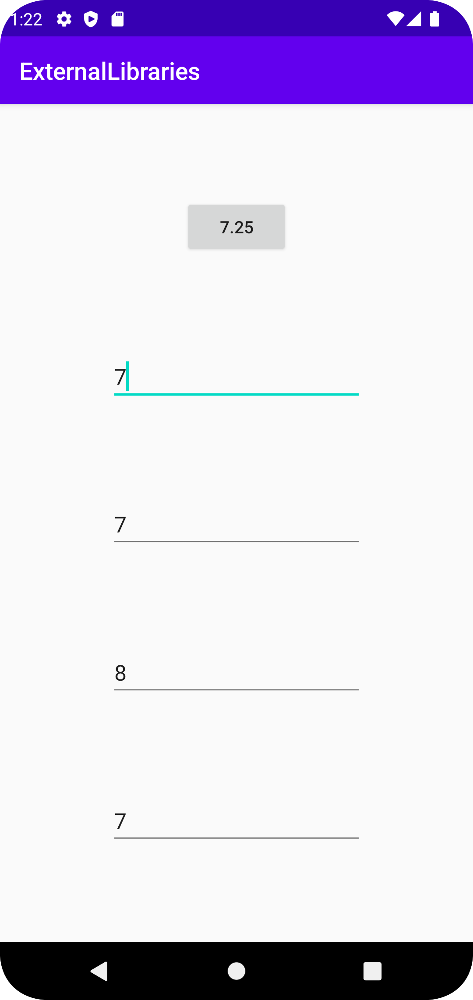

# Rapport

**Skriv din rapport här!**

1. **Finding an External Library**:
   I chose the Apache Commons Math library, a powerful and versatile toolkit for various mathematical operations. This library offers functionality that simplifies the task of statistical analysis among other mathematical computations.

2. **Adding the Library as a Dependency**:
   To include the Apache Commons Math library in the project, I added the following line to the `app/build.gradle` file under dependencies:
   ```groovy
   implementation 'org.apache.commons:commons-math3:3.6.1'
   ```
   This line tells the Gradle build system to fetch the specified version of the library and make it available for use in the project.

3. **Modifying XML Layout and Java Code**:
   To utilize the new library, I first updated the app’s user interface layout in the XML file, adding four decimal input fields and a button to trigger the calculation. Here’s a snippet from the Java code in `MainActivity`, where I set up these UI elements:
   ```java
   editTextNumberDecimal1 = findViewById(R.id.editTextNumberDecimal1);
   editTextNumberDecimal2 = findViewById(R.id.editTextNumberDecimal2);
   editTextNumberDecimal3 = findViewById(R.id.editTextNumberDecimal3);
   editTextNumberDecimal4 = findViewById(R.id.editTextNumberDecimal4);
   button = findViewById(R.id.button);
   ```

4. **Implementing Functionality Using the External Library**:
   In the `calculate` method, I created an instance of `DescriptiveStatistics` from the Apache Commons Math library. This object allows for the accumulation of numerical data to compute statistics like the mean:
   ```java
   DescriptiveStatistics statistics = new DescriptiveStatistics();
   statistics.addValue(Integer.valueOf(editTextNumberDecimal1.getText().toString()));
   statistics.addValue(Integer.valueOf(editTextNumberDecimal2.getText().toString()));
   statistics.addValue(Integer.valueOf(editTextNumberDecimal3.getText().toString()));
   statistics.addValue(Integer.valueOf(editTextNumberDecimal4.getText().toString()));
   button.setText("" + statistics.getMean());
   ```
   Here, each value entered by the user is added to the `statistics` object. When the user presses the button, the mean of these values is calculated and displayed on the button itself.
Bilder läggs i samma mapp som markdown-filen.



Läs gärna:

- Boulos, M.N.K., Warren, J., Gong, J. & Yue, P. (2010) Web GIS in practice VIII: HTML5 and the canvas element for interactive online mapping. International journal of health geographics 9, 14. Shin, Y. &
- Wunsche, B.C. (2013) A smartphone-based golf simulation exercise game for supporting arthritis patients. 2013 28th International Conference of Image and Vision Computing New Zealand (IVCNZ), IEEE, pp. 459–464.
- Wohlin, C., Runeson, P., Höst, M., Ohlsson, M.C., Regnell, B., Wesslén, A. (2012) Experimentation in Software Engineering, Berlin, Heidelberg: Springer Berlin Heidelberg.
